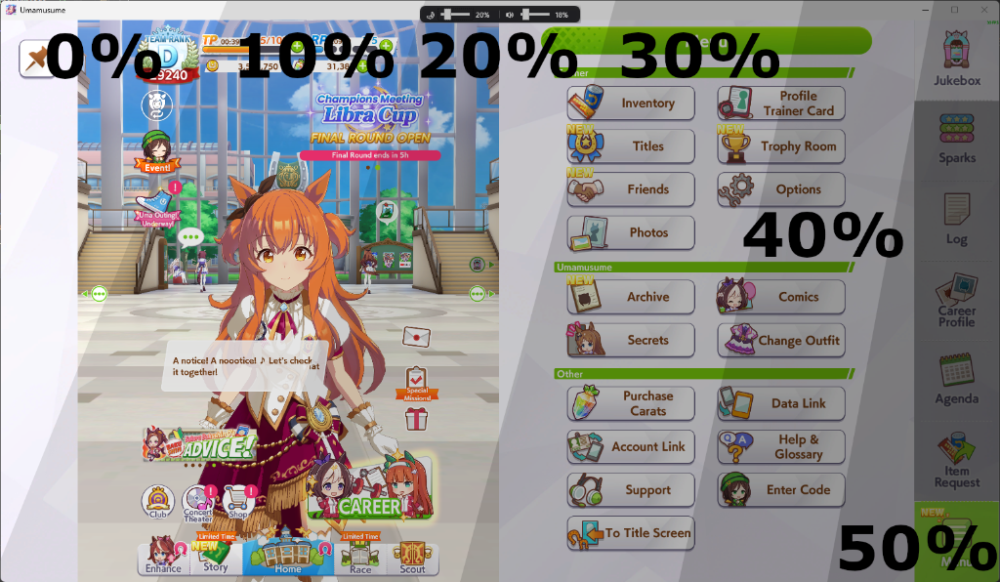

# Umamusume Dark Mode Overlay

A lightweight dark mode overlay and audio companion for the PC/DMM client of **Umamusume: Pretty Derby** (`UmamusumePrettyDerby.exe`).

Matches the game window bounds in real time, applies an adjustable black tint without blocking mouse clicks, and provides a floating control bar with master volume control, auto-mute on focus loss, and system tray integration.



---

## Features

- **Floating Control Bar**
  - Compact bar anchored at the top-center of the game window.
  - **Opacity Slider (0% – 90%)**: Adjusts screen darkness. Capped at 90% for window stability.
  - **Master Volume Slider (0% – 100%)**: Controls game master volume directly via Windows Core Audio (WASAPI).

- **Expandable Options Menu**
  - **Right-click** anywhere on the control bar to toggle settings:
    - **Mute on focus loss**: Automatically mutes the game when switching to another window or minimizing, and restores audio when returning.
    - **Autostart with Windows**: Manages a shortcut in Windows Startup (`shell:startup`). Automatically revalidates and updates the target path if the executable is ever moved.

- **System Tray Integration**
  - **No Taskbar Clutter**: Runs in the background without occupying space on the Windows taskbar (`ShowInTaskbar="False"`).
  - **Left-Click**: Toggles or brings the control bar to the front.
  - **Right-Click**: Context menu with **Settings** and **Exit**.

- **Two-Loop Tracking Engine**
  - **Idle Loop**: Checks for the game process once every 15 seconds when not running.
  - **Active Loop**: Tracks window position and bounds at ~60 fps while the game is running.

---

## Download and Usage

### Running the Executable
1. Download the latest `UmamusumeDarkMode.exe` from the **Releases** section.
2. Place `UmamusumeDarkMode.exe` in any folder of your choice (e.g. on your Desktop or in `C:\Users\<Username>\Desktop\UmamusumeDarkMode\`).
3. Run `UmamusumeDarkMode.exe`.
   - The app icon will appear in your Windows System Tray (notification area).
   - *(Optional)* Right-click the control bar (or tray icon) and enable **Autostart with Windows**.

### Working with the Game
- You can launch `UmamusumeDarkMode.exe` either before or after starting Umamusume.
- When the game window is detected, the overlay and control bar attach automatically.
- When the game is minimized or loses focus, the overlay hides (and audio mutes, if enabled) until focus returns.

---

## Controls Reference

| Action | Method |
| :--- | :--- |
| **Adjust Darkness** | Drag the **Moon Slider** (defaults to 40%). |
| **Adjust Master Volume** | Drag the **Master Volume Slider**. |
| **Open Settings Menu** | **Right-click** anywhere on the control bar. |
| **Toggle Mute on Focus Loss** | Click **Mute on focus loss** in the options menu. |
| **Toggle Windows Autostart** | Click **Autostart with Windows** in the options menu. |
| **Tray Menu** | **Right-click** the system tray icon for **Settings** or **Exit**. |

---

## Configuration

Settings are saved locally in JSON format at:
```text
%LocalAppData%\UmamusumeDarkMode\settings.json
```
Stores your configured opacity, master volume level, and focus-mute preference across sessions.

---

## Building from Source

### Prerequisites
- Windows 10 / 11
- [.NET 8.0 SDK](https://dotnet.microsoft.com/download/dotnet/8.0)

### Build Command
```powershell
git clone https://github.com/your-username/UmamusumeDarkMode.git
cd UmamusumeDarkMode
dotnet build -c Release
```

### Publish Single-File Executable
```powershell
dotnet publish UmamusumeDarkMode\UmamusumeDarkMode.csproj -c Release -r win-x64 --self-contained false -p:PublishSingleFile=true
```
The output binary will be located in:
```text
UmamusumeDarkMode\bin\Release\net8.0-windows\win-x64\publish\UmamusumeDarkMode.exe
```

---

## License
MIT License
